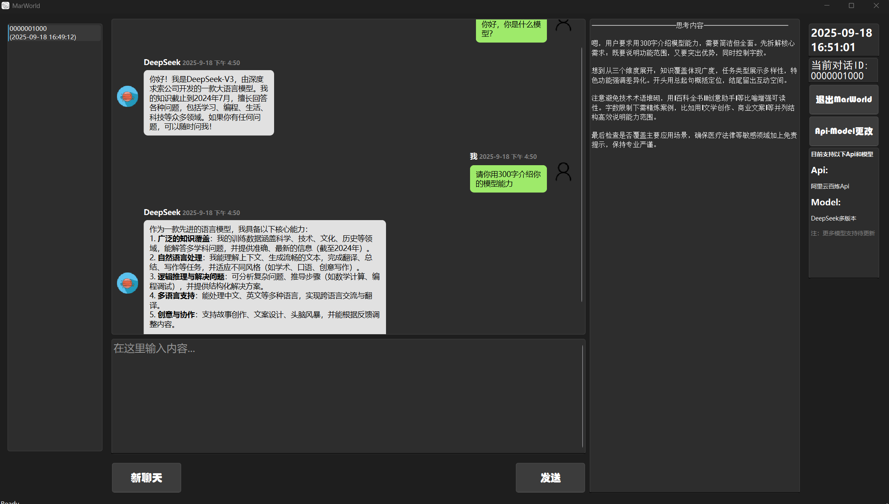

# DeepSeekApi_Gui_MarWorld

一个基于 **Python + PyQt6** 的本地桌面对话应用。  
用户只需输入自己的 **API Key** 和 **模型名称**，即可直接调用大模型进行对话，支持流式输出、思维过程展示、对话记录保存，无需服务器支持，开箱即用。
   > ⚠️ 目前仅支持阿里云百炼Api以及百炼平台所提供的多个版本的DeepSeek模型  ️⚠️
---
   > ⚠️ 请自行在阿里云百炼平台注册Api,本软件不提供具体的Api资源支持!  ️⚠️
---
   > 阿里云百炼平台 https://bailian.console.aliyun.com/
## ✨ 功能特点
- **纯本地化运行**：双击 `.exe` 即可使用，不依赖云端服务器或数据库服务，数据使用JSON存储于本地
- **大模型调用**：支持输入自定义 API Key / Model，与大模型实时对话。  
- **流式输出**：同时展示模型的 *思考过程* 与 *最终回答*。  
- **对话日志管理**：
  - 每次对话会生成唯一 ID。  
  - 所有对话内容（用户输入 / 模型思考 / 模型回答）均自动保存。  
  - 可在左侧列表中加载并查看历史对话。  
- **图形化界面 (GUI)**：类似微信的聊天气泡界面，支持头像、时间戳、自动滚动。

---

## 🖼️ 界面展示



---

## 🛠️ 技术栈
- **语言**：Python 3.10+  
- **界面**：PyQt6  
- **多线程**：QThread  
- **API 调用**：OpenAI SDK（兼容阿里云 DashScope / DeepSeek API）  
- **数据存储**：JSON（可扩展为 SQLite 本地数据库）  

---

## 📂 项目结构
```
DeepSeekApi_Gui_MarWorld/
├── button.py                # 按钮与交互逻辑
├── chat_display_screen.py   # 聊天窗口与气泡显示
├── core.py                  # API 调用与信号管理
├── dialogue_id.py           # 对话 ID 管理
├── dialogue_id_list_window.py # 对话历史列表
├── gui.py                   # 主窗口与整体布局
├── log_dialogue.py          # 日志系统（JSON 存储）
├── settings.py              # 界面配置与参数
├── worker_thread.py         # 异步线程
├── run_core.py              # 程序入口
```

---

## 🚀 使用方法

1. 前往 [Releases](https://github.com/yourname/DeepSeekApi_Gui_MarWorld/releases) 页面  
2. 下载最新的 `MarWorld.zip`  
3. 解压缩后，双击运行 `MarWorld.exe` 即可使用  
   > ⚠️ 无需安装 Python 或其他依赖  
4. 源代码打包.exe文件指令
   > python -m PyInstaller -F -w run_core.py -n MarWorld --icon=mar.ico --add-data "mar.ico;." --add-data "my_avatar.png;." --add-data "avatar.png;."

---

## ⚡ 未来改进方向
- [ ] 使用 SQLite 替代 JSON，提供更强的数据管理能力。  
- [ ] 支持多种大模型 API（如 OpenAI、Claude 等）。  
- [ ] 增加“设置”页面，支持主题切换、快捷键自定义。  
- [ ] 增加对话导出（Markdown / PDF）。  

---

## 📜 许可证
MIT License
